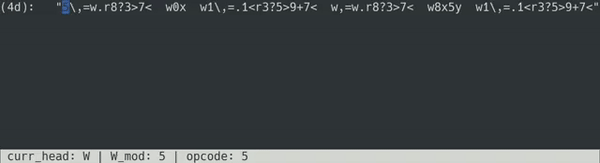

# scaffolding

scaffolding is a dumb esolang. That's basically it. This repo contains my implementation of it's interpreter.

The whole idea of it is **destructive execution** - writing the result of the source code to the same file it's read from.

So, effectively, You could just overwrite the source during execution.

Sounds fun, right? Let me assure You - it's not!


# Example

### One-line program example:
```scaf
5\,=w.r8?3>7<  w0x  w1\,=.1<r3?5>9+7<  w,=w.r8?3>7<  w8x5y  w1\,=.1<r3?5>9+7<
```
Output:



### Multi-line program example:
```scaf
9>.4\r3\
 .
.
   w/r.5<
```
Output:


These visuals were made with [franeklubi/scaf-visualizer](https://github.com/franeklubi/scaf-visualizer).

Yo and check out the [tutorial](./doc/tutorial.md).


# Building

To build the scaffolding interpreter/cli tool using make:

```sh
$ make prod // to build normally
$ make      // to build with the debug messages turned on
```


# Usage:

``` sh
$ scaf [options] file...
```

### options:
- `-f` 'force' - Don't check if file is a scaf source (The true chad flag).
- `-n` 'non-destructive' - Output to filename.out (Don't overwrite file) (coward).
- `-o <path>` 'output' - Output to `<path>` (Takes precedence over -n).
- `-h` 'help' - Display the help message.


# FAQ
(does it count if I am the one asking these?)

**Q:** How do I even write in this?

**A:** Check out the [tutorial](./doc/tutorial.md).

<br>

**Q:** but why?

**A:** I thought this idea was so stupid *it had to be done* (no it really didn't)

<br>

**Q:** Have I ran out of questions already?

**A:** Yes. 🤠
