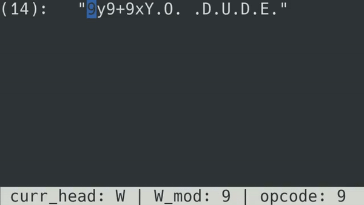

# tutorial

Alright, You decided to embark on the adventure of learning how to use **scaffolding**!

I couldn't be more sorry for You!


# Introduction

I recommend opening the [list of opcodes](./opcodes.md), You'll need it for reference.

In this tutorial I'll analyse and explain a couple of programs written in scaf.

Before that, let's lay down some fundamentals first:
- The **Read Head** (blue) and the **Write Head** (red) both initially start at position (0, 0).
- The **Read Head** advances automatically until it reaches an illegal position (outside the buffer).
- **Current Head** points to the **Write Head** by default.


# [absolute.scaf](../sample_programs/absolute.scaf)

```scaf
9y9+9xY.O. .D.U.D.E.
```





# [loop.scaf](../sample_programs/loop.scaf)

```scaf
a.b.07<
```
